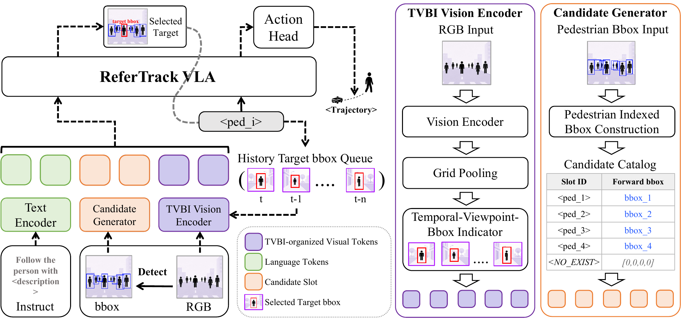

<h1 align="center">ReferTrack: Referring Then Tracking for Embodied Visual Tracking</h1>

    <a href="https://medlartea.github.io/">Hanjing Ye</a>1,2
    &nbsp;
    <a>Tianle Zeng</a>1
    &nbsp;
    <a href="https://jzhzhang.github.io/">Jiazhao Zhang</a>3
    &nbsp;
    <a href="https://wsakobe.github.io/">Shaoan Wang</a>3
    &nbsp;
    <a>Zibo Zhang</a>4
     
    <a href="https://situ-weixi.github.io/">Weisi Situ</a>1
    &nbsp;
    <a href="https://yuchen2199.github.io/">Yuchen Zhou</a>2
    &nbsp;
    <a href="https://ygling2008.github.io/">Yonggen Ling</a>2,4*
    &nbsp;
    <a href="https://scholar.google.com/citations?user=J7UkpAIAAAAJ&hl=en">Hong Zhang</a>1*

    1RCV Laboratory, SUSTech
    &nbsp;
    2Tencent Robotics X
     
    3Peking University
    &nbsp;
    4Futian Laboratory

    <a href="">arXiv</a>
    &nbsp;|&nbsp;
    <a href="">Video</a>

## Overview

**_ReferTrack_** is a *referring-then-tracking* paradigm for embodied visual tracking that first grounds a language-described target to an image-space bounding box and then decodes tracking waypoints from this decision, using temporal-viewpoint-bbox indicator (TVBI) tokens to inject previously selected bounding boxes into the visual history and preserve target motion cues over time, achieving state-of-the-art single-view performance on EVT-Bench with robust sim-to-real transfer to legged and humanoid robots.

    

## TODO List

* [ ] Release model checkpoints and evaluation code.
* [ ] Release the dataset.
* [ ] Release the training code.
* [ ] Release the data engine.
